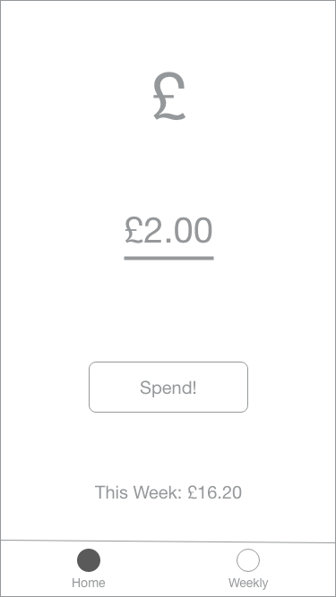
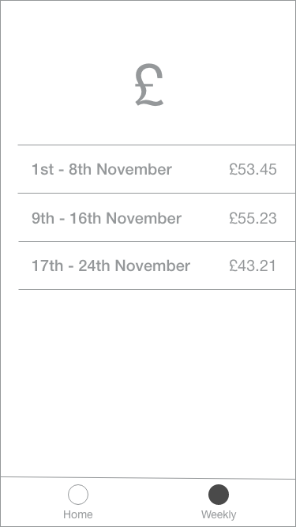

# Spend

*Welcome for Hacktoberfest!*

Spend is a small React Native application that is used for tracking weekly spending. Maybe a fun hacktoberfest project to build up your React Native portfolio and PR count!

### Idea

Spend is simple. You input how much you just spent and press "Spend!", and it adds it to your weekly spend.

At the end of the week it resets back to 0 (idea is weekly budget) and saves to the weekly tracker table.

### The Hack

Currently we have a React Native template, and I think the following issues should be built first:

1. Basic Navigation (Tab Bar) & UI
1. Saving current spend to user defaults after spending
2. Reset the budget every week and persisting to the summary table

### Wireframe Designs

Here are some wireframe designs:

